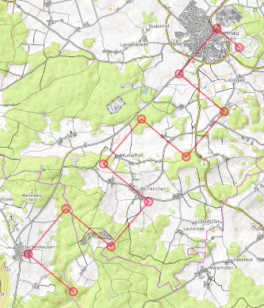
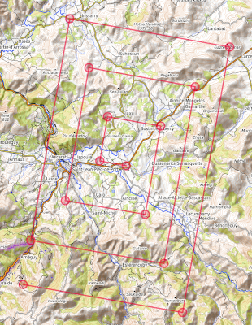
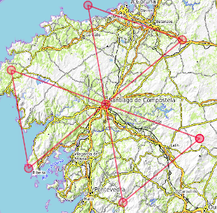

# Calculate Rescue Patterns

Search and Rescue operations use defined flight path patterns to fully
cover areas where to find somebody or something.

The script *pattern.py* outputs data for the the Ladder, Square, and
Sector patterns. They can be piped into other well known tools for
analysis and display.

## Ladder
The example shows the creation of a ladder pattern:
```
python pattern.py -p ladder  -o 220 -l 6 -w 2 -n 49.05 -e 11.8 -r false
```
It generates twelve pattern points with coordinates, leg directions and lengths:
```
@000 360/000.0    0.00    0.00  49.0500   11.8000 360/000.0
@001 310/000.5    0.32   -0.38  49.0554   11.7903 310/000.5
@002 220/001.0   -0.44   -1.03  49.0426   11.7739 220/001.0
@003 130/001.0   -1.09   -0.26  49.0319   11.7934 130/001.0
@004 220/001.0   -1.85   -0.90  49.0191   11.7770 220/001.0
@005 310/001.0   -1.21   -1.67  49.0298   11.7576 310/001.0
@006 220/001.0   -1.98   -2.31  49.0171   11.7412 220/001.0
@007 130/001.0   -2.62   -1.55  49.0063   11.7607 130/001.0
@008 220/001.0   -3.39   -2.19  48.9936   11.7444 220/001.0
@009 310/001.0   -2.74   -2.95  49.0043   11.7249 310/001.0
@010 220/001.0   -3.51   -3.60  48.9915   11.7085 220/001.0
@011 130/001.0   -4.15   -2.83  48.9808   11.7280 130/001.0
#LADDER has 6 areas with 11 legs and a planned travel distance of 10.5 NM.
#LADDER has start lat:49.0500 lon:11.8000 orientation:220 length:6.0 width:2.0 spacing:1.00 right:0
```

The output may piped into well known tools to  select coordinates and  to generate a GPX file:

```
python pattern.py -p ladder  -o 220 -l 6 -w 2 -n 49.05 -e 11.8 -r false | \
	awk '/^@/{printf("%s,%s\n", $5,$6)}' | \
	gpsbabel -i csv -o gpx -f - -x transform,trk=wpt -F ladder.gpx
```

This is the display in [opentopomap](http://opentopomap.org) after loading *ladder.gpx*:




## Square
The example shows the generation of a GPX file for the square pattern.

```
python pattern.py -p square -o 280 -l 6 -w 10 -n 43.16692 -e -1.19094| \
	awk '/^@/{printf("%s,%s\n", $5,$6)}' | \
	gpsbabel -i csv -o gpx -f - -x transform,trk=wpt -F square.gpx
```

This is the display in [opentopomap](http://opentopomap.org) after loading *square.gpx*:



## Sector
The example shows the generation of a GPX file for the sector pattern.
```
python pattern.py -p ector -o 110 -l 30 -n 42.88019 -e -8.54043 | \
	awk '/^@/{printf("%s,%s\n", $5,$6)}' | \
	gpsbabel -i csv -o gpx -f - -x transform,trk=wpt -F sector.gpx
```

This is the display in [opentopomap](http://opentopomap.org) after loading *sector.gpx*:


